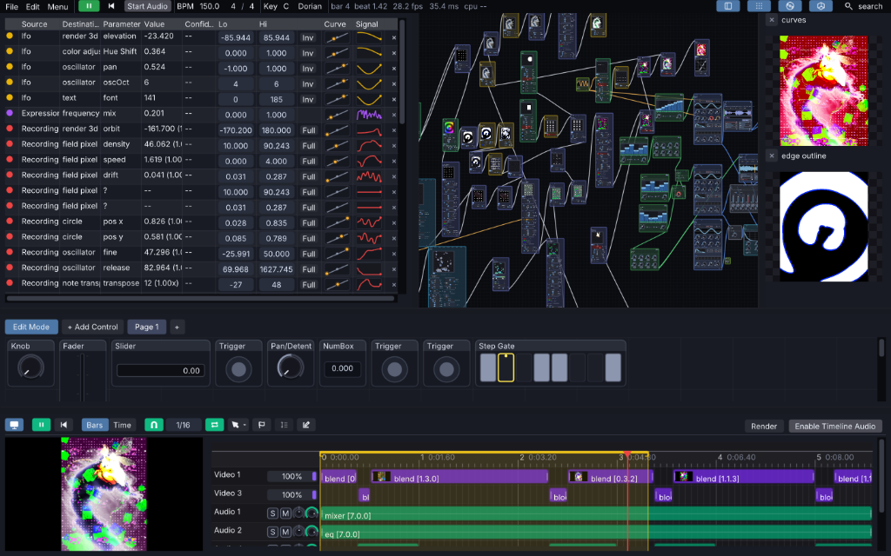
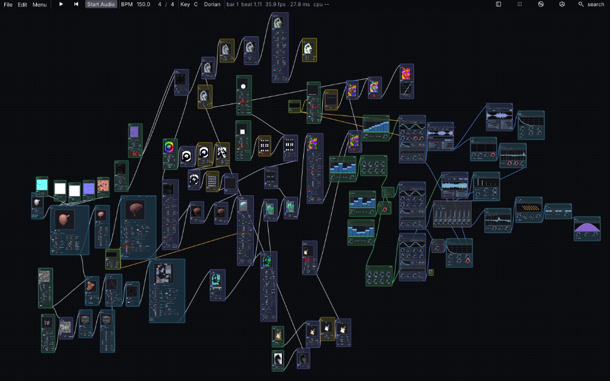
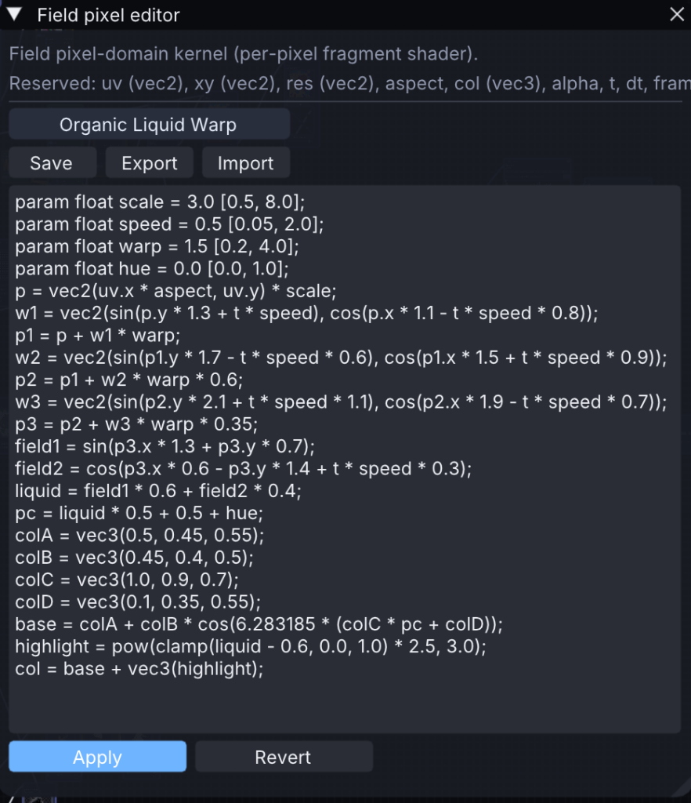

# Infinite

[](https://discord.gg/wpKdexvhn)
[](https://www.youtube.com/watch?v=vXRjrDhSq24&t=1421s)
[](https://github.com/n1m21n/Infinite)
[](LICENSE)
[](https://trendshift.io/repositories/187223?utm_source=trendshift-badge&utm_medium=badge&utm_campaign=badge-trendshift-187223)

A unified node-based audiovisual modular workstation for **macOS**, **Windows**, and **Linux**. Real-time GPU image/video compositing, procedural 3D geometry and physics, and a full modular synthesizer rack with native AU and VST3 plugin hosting — all interconnected through a universal modulation graph. Most nodes do one fixed thing; **Field**, Infinite's embedded programming language, lets you write what a node does instead.



---

## Video Tutorial

> **New to Infinite?** Watch the full walkthrough and workflow tutorial on YouTube:  
> 🔗 **[Infinite Video Walkthrough & Tutorial](https://www.youtube.com/watch?v=vXRjrDhSq24&t=1421s)**

---

## Highlights

- **Arrangement Timeline**: A full clip-based arrangement editor alongside the node canvas — tick-accurate scheduling off the same BPM transport, blade tool, track groups, marquee multi-select, drag-and-drop media import, live waveform/video-thumbnail rendering, and a render/export queue.
- **Dual Synchronized DAG Engine**: High-throughput GPU texture pipeline (GLSL / OpenGL 3.2 Core) running in lockstep with a sample-accurate, pull-based audio graph tied to a global BPM transport.
- **Universal Cross-Domain Modulation**: Modulate any shader parameter, 3D transform, audio synth control, or hosted plugin slider via LFOs, CV sequencers, live audio FFT spectrum analysis, or video analysis.
- **Audio Synthesis & Physical Modeling**: Wavetable oscillator, modal metallic physical resonator, real-time granular engine, PaulStretch spectral stretcher, multi-sample player, and 8-track drum machine.
- **AU & VST3 Plugin Hosting**: Host third-party **Audio Unit** (macOS) and **VST3** (macOS, Windows, Linux) plugins with native GUI windows and automatable/modulatable parameter controls.
- **Procedural 3D & Physics Solvers**: Meshes, 3D splines, point scattering, single-draw-call GPU instancing (`Instance on Points`), PBD cloth/soft-body physics, particle systems, and PBR rendering (Cook-Torrance GGX + ACES tonemapping + 32-bit HDRI).
- **2D Shaders & Generative FX**: 32 blend modes, live GLSL editor, video & camera playback, Syphon (macOS) / Spout (Windows) zero-copy video I/O, reaction-diffusion, and on-device ML subject background removal.

---

## Node Library Overview

Infinite features **140+ modular node types**:

| Domain | Key Nodes |
|---|---|
| **2D & Video** | Image, folder Slideshow, Video (hardware-accelerated), Syphon In / Spout In, Paint/Draw canvas, GLSL Formula editor, Shapes (SDF), Noise & Gradient Ramps |
| **2D FX & Grading** | Blur, Bloom, Glitch (6 modes), Twirl, Ripple, Displace, Halftone, Curves (RGB/Luma splines), Color Ramp, .cube LUTs, Gradient Map, Palette extraction |
| **Compositing & Masks** | Blend (32 modes), Layer Stack, Remove Background (on-device ML segmentation), Chroma/Luma Key, Feedback loop, Reaction-Diffusion, Resynthesize |
| **3D Geometry & FX** | Primitives, USD/OBJ/PLY/STL/glTF/GLB import, 3D Text, 3D Curves, Point Distribution, Mesh Deconstruction, Taubin Smooth, Array, Instancing, Metaballs |
| **3D Scene & Render** | Camera (orbit/perspective/ortho), Lights, 32-bit HDRI Environment, PBR Materials, ACES Tonemapping, Multisampled Antialiasing |
| **Synths & Sound** | Wavetable synth, Metallic modal resonator, Granular synth, PaulStretch, Molder / Grain Molder (spectral resynthesis), Sampler, Slicer (onset-detecting sample chopper), 8-track Drum Sequencer, Multi-waveform Oscillator |
| **Field Language** | Field Modifier, Field Primitive, Field Effect, Field Synth, Field Pixel, Field Graph — see [below](#field-write-what-a-node-does) |
| **Notes & MIDI** | Live MIDI input/clock, Arpeggiator, Note Sequencer, Chorder, Strum, Bouncing Balls (physics notes), Humanizer, Quantizer |
| **Audio FX & Plugins** | **AU / VST3 Plugin Host**, Filters, EQ, Dynamics, Lookahead Limiter, Delay, Reverb, Drive/Saturation, Pitch & Frequency Shifters, Chorus, Phaser, Formant |
| **Modulators & Analysis** | LFO, Random, Pattern CV, Envelope Follower, Math, XY Pad, Audio Analyze (8-band FFT / onset), Image Analyze (luminance / motion) |
| **Output & I/O** | PNG snapshot, H.264/MOV video recording with synchronized audio, Syphon Out / Spout Out |

The full catalogue, including every node's pins and parameters, is in the [Node Reference Manual](Infinite_Node_Reference_Manual.pdf).



---

## Field: write what a node does

Every other node in Infinite does one fixed thing — a Blur node blurs, a Delay node delays. **Field** nodes are different: you write a short kernel, and Field figures out where it runs from what the code touches.

```
col = vec3(uv.x, uv.y, 0.5)              // once per pixel, on the GPU — a shader
P.y += sin(P.x * 4.0 + t) * 0.2          // once per point in a mesh — a geometry deformer
out = in * gain                          // once per audio sample — a DSP effect
```

That's the one idea underneath the whole language: a **kernel**, run once per element of a **domain**, forever. You never declare where it runs — the domain (and therefore the backend it compiles to) is inferred. Field currently spans five domains and six node types:

| Node | Domain | What it does |
|---|---|---|
| **Field Modifier** | element | Per-vertex kernel over existing geometry — modifies `P`, `N`, `uv`, `Cd` and custom attributes |
| **Field Primitive** | element | Generates procedural point geometry from scratch (Circle, Spiral, Grid Lattice, Fibonacci Sphere, Helix, Torus Knot) |
| **Field Effect** | sample | Per-sample audio DSP kernel; `in`/`out`, `state` for per-voice memory, `param` for knobs |
| **Field Synth** | sample | Polyphonic note-driven synth voice using the same sample compiler, with `freq`/`gate` in place of an audio input |
| **Field Pixel** | pixel | Per-pixel kernel compiled straight to GLSL; `state` cells with `[wrap]` support feedback and stencils |
| **Field Graph** | graph | Runs once at edit time — `emit()`/`connect()`/`set()`/`place()` declaratively mount and wire real Infinite nodes into a bundle ("Instrument Mode" collapses it to one box; "Unpack to Canvas" expands it back out) |

Any element/pixel/sample kernel can also declare **dynamic pins** right in its code, adding real, cable-wireable, save/load-safe I/O to the node without touching C++. Finished devices — kernel plus params plus presets — save, load, export and import as portable `.field` files, so a Field patch is shareable like an audio plugin preset. The full language reference — syntax, domain-transfer operators, reserved words, and the complete node/format reference — is in the [Field Language Manual](Field_Language_Manual.pdf).

<p align="center">
  
</p>

---

## Installation & Quick Start

### Pre-built App (macOS, Windows & Linux)
Download the latest build for your platform from [GitHub Releases](https://github.com/n1m21n/Infinite/releases): `Infinite.dmg` for macOS, `Infinite-windows-x64.zip` / `Infinite-windows-ARM64.zip` for Windows, or `Infinite-x86_64.AppImage` for Linux.

**macOS**
1. Open the DMG and drag `Infinite.app` to Applications.
2. Right-click `Infinite.app` → **Open** → Click **Open** (ad-hoc signed).
3. If blocked by Gatekeeper quarantine, run in Terminal:
   ```bash
   xattr -dr com.apple.quarantine /Applications/Infinite.app
   ```

**Windows**
1. Unzip the `x64` or `ARM64` build for your CPU.
2. Run `Infinite.exe`. If SmartScreen blocks it, click **More info** → **Run anyway**.

**Linux**
1. `chmod +x Infinite-x86_64.AppImage`
2. Run `./Infinite-x86_64.AppImage`. It bundles the static AppImage runtime, so no `libfuse2` install is needed. If it's running in a container or on a system with no `/dev/fuse`, use `./Infinite-x86_64.AppImage --appimage-extract-and-run` instead.

---

## Build from Source

### macOS
Requirements: **CMake 3.16+** and **Xcode Command Line Tools**.

```bash
git clone https://github.com/n1m21n/Infinite.git
cd Infinite
cmake -B build -DCMAKE_BUILD_TYPE=Release
cmake --build build -j8
open build/Infinite.app
```

*To create a standalone DMG installer, run `./package.sh`.*

### Windows
Requirements: **CMake 3.16+** and **Visual Studio 2022/2026** (MSVC v143+, Desktop development with C++).

```powershell
git clone https://github.com/n1m21n/Infinite.git
cd Infinite
cmake -S . -B build -G "Visual Studio 17 2022" -A x64
cmake --build build --config Release
.\build\Release\Infinite.exe
```

*To create a packaged portable folder, run `powershell -ExecutionPolicy Bypass -File package.ps1`.*

### Linux
Requirements: **CMake 3.16+**, a C++20 compiler (Clang or GCC), Ninja, and the dev packages in `tools/linux/deps-apt.sh` (X11/GLFW/ALSA/fontconfig headers etc.). x86_64, glibc ≥ 2.35 (Ubuntu 22.04+ or equivalent) if you want the result to match the published AppImage's floor.

```bash
git clone https://github.com/n1m21n/Infinite.git
cd Infinite
tools/linux/deps-apt.sh   # installs build + runtime deps via apt
tools/linux/build.sh      # configures + builds build-linux/Infinite
./build-linux/Infinite
```

*To package a portable AppImage, run `tools/linux/package-appimage.sh build-linux artifacts-linux`.* A containerized dev environment (no local dep install needed) is available via `tools/linux/local.sh build` — see that script for details.

---

## Architecture

```
src/
├── core/         # INode DAG engine, ImageCable, Transport, Modulation, GLUtil, Mesh
├── nodes/        # 160+ Node implementations (2D, 3D, Audio, Synth, Notes, Modulation)
├── audio/        # Audio engine, DSP kernels, Wavetable core, Plugin hosting (AU/VST3)
└── platform/     # OS layer: macOS (CoreAudio/AU/AVFoundation) | Windows (WASAPI/WinMM/Media Foundation/GDI+) | Linux (ALSA/GLFW/X11/VST3)
```

See [ARCHITECTURE.md](ARCHITECTURE.md) and [docs/CODE_STANDARDS.md](docs/CODE_STANDARDS.md) for deeper implementation guides.

---

## Linux-specific known limits

The Linux build has the same node graph and file format as macOS/Windows, with these platform gaps:

- No Syphon/Spout equivalent — no zero-copy video I/O with other apps.
- No Audio Unit (AU) hosting — VST3 only (same as Windows).
- No LV2 plugin hosting.
- No complex-script text shaping (no HarfBuzz) — Latin-script text renders correctly, but right-to-left and complex scripts (Arabic, Devanagari, etc.) may not.
- VST3 plugin editor windows need X11 or XWayland; a pure-Wayland session without XWayland cannot show plugin GUIs.
- x86_64 only — no arm64 build is published.

---

## Contributing

Contributions, bug reports, and node ideas are welcome!
- Join the discussion and share creations in our [Discord Community](https://discord.gg/wpKdexvhn).
- File bugs or feature requests in [GitHub Issues](https://github.com/n1m21n/Infinite/issues).
- Submit Pull Requests with clean-room MIT-compatible code following [docs/CODE_STANDARDS.md](docs/CODE_STANDARDS.md).

---

## Prior Art & Acknowledgements

Infinite is written from scratch, but its ideas stand on a long line of tools that came before it. We want to name them plainly.

**Node-based audio and visual environments.** Patching signal through a graph of modules is the tradition of [Max/MSP and Jitter](https://cycling74.com/), [Pure Data](https://puredata.info/), [Reaktor](https://www.native-instruments.com/en/products/komplete/synths/reaktor-6/), [Bitwig's The Grid](https://www.bitwig.com/the-grid/), [VCV Rack](https://vcvrack.com/) and [BespokeSynth](https://www.bespokesynth.com/). Mixing audio, video and 3D in one graph is the territory of [TouchDesigner](https://derivative.ca/), Max/Jitter and [Houdini](https://www.sidefx.com/). Infinite's early architecture, including a name-based node registry, pull-based per-frame cooking and a single node shell that hosts many effect types, was designed after studying how BespokeSynth structures its modules. Infinite contains no BespokeSynth source code.

**Geometry.** The per-element attribute model (`P`, `N`, `uv`, `Cd`) follows Houdini's SOP conventions. Several geometry nodes follow behaviour a [Blender Geometry Nodes](https://docs.blender.org/manual/en/latest/modeling/geometry_nodes/) user would expect, and some compositing nodes are named after their TouchDesigner equivalents (Fit, for example).

**Field.** Field's building blocks all have precedent:
- per-element kernels over geometry attributes come from Houdini VEX, and an early draft even used VEX's `@` sigil before it was removed;
- running parts of a program at different rates follows Faust's computation levels and the rate model in V. Norilo, *"Kronos: A Declarative Metaprogramming Language for Digital Signal Processing"*, Computer Music Journal 39:4 (2015);
- `param` declarations echo Houdini's `chf()` and Cabbage's markup;
- pixel kernels compile to GLSL in the way Shadertoy-style tools work.

What Field adds is putting these together: **one kernel syntax whose domain (graph, frame, element, pixel or sample) is inferred from what the code touches**, compiled to the matching backend and wired into a live audiovisual node graph as real, modulatable, savable nodes.

**How it is built.** Infinite is developed by n1m21n with extensive AI coding assistance from Anthropic's Claude. AI-assisted commits carry a `Co-Authored-By` trailer in the git history.

**Third-party libraries** are vendored under `external/` and `third_party/`, each with its own licence (Dear ImGui, imgui-node-editor, miniaudio, dr_libs, stb, nlohmann/json, tinyfiledialogs and others). The Steinberg VST3 SDK is covered under [License](#license) below, and libraries that carry extra distribution obligations (FFmpeg, x264, Signalsmith Stretch) are documented in [THIRD_PARTY_NOTICES](THIRD_PARTY_NOTICES).

---

## License

Infinite's source code is licensed under the [MIT License](LICENSE).  
Default builds include VST3 plugin hosting linking the [Steinberg VST3 SDK](https://github.com/steinbergmedia/vst3sdk) (GPLv3). Build with `-DINFINITE_ENABLE_VST3=OFF` for a pure MIT binary.

