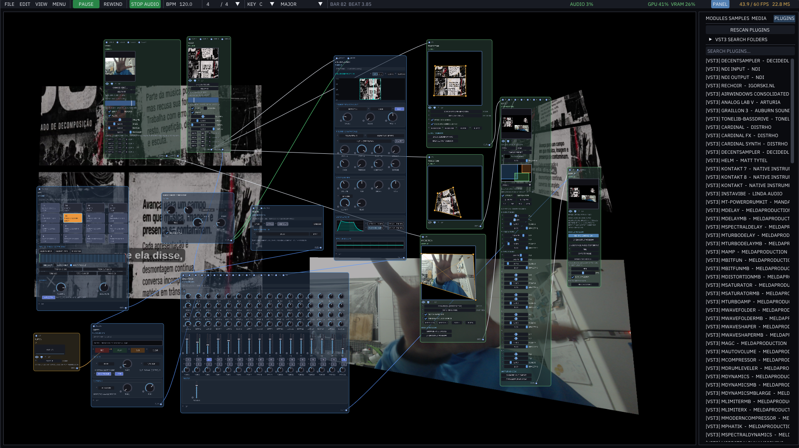

# This Fork
This fork is completed vibe-coded and it was made to run entirely on Windows. I will not be maintaining this to keep up with the current version. I don't own a Mac so I can't see what the official version actually looks like so if there are any immediate bugs please notify me. Theoretically this can also run on Mac. 


# Infinite

A unified node-based audiovisual modular workstation for **macOS** and **Windows**. Real-time GPU image and video compositing, procedural 3D geometry and simulation, and a full modular synthesizer and DSP rack with plugin hosting (Audio Unit on macOS; VST3 hosting available as an opt-in build flag, see below) — all interconnected through a universal modulation graph.

Architecturally it is a descendant of [BespokeSynth](https://github.com/BespokeSynth/BespokeSynth)'s module system — a registry of node types, typed cables, and a pull-based cook-once-per-frame DAG — extended across GPU textures, procedural geometry, and real-time audio buffers.



---

## Features Overview

**160+ node types across comprehensive creative domains:**

| Category | Description & Nodes |
|---|---|
| **Source** | **Image**, **Video** (hardware-accelerated AVFoundation), **Syphon In** (zero-copy real-time GPU video receiver from OBS, Resolume, TouchDesigner, etc.), **Shape** (10 SDF primitives), **Noise** (6 kinds: Value, Perlin, Voronoi, Ridged, Simplex, White), **Ramp** (5 gradient types: Linear, Radial, Angle, Diamond, Box), **Texture** (Voronoi, Brick, Magic, Wave, Musgrave), **Draw** (paintable canvas with 6 procedural brushes, eraser, and transport-synced stroke recording), **Formula** (live GLSL fragment editor with 16 presets) |
| **Text** | **Text** (typography rendered via CoreText / CoreGraphics with any system font, kerning, line spacing, and alignment) |
| **2D Effects** | **Blur** family (Gaussian, Box, Motion, Radial), **Bloom**, **Diffuse Glow**, **Unsharp Mask**, **Twirl**, **Pinch-Punch**, **Ripple**, **Lens Distortion**, **Displace**, **Liquify**, **6 Glitch modes**, **Symmetry**, **Kaleidoscope**, **Mirror Tile**, **Halftone**, **Sobel Edge**, **Edge Outline**, **Pixelate**, **Noise**, **Vignette**, **Transform** |
| **Color & Grading** | **Curves** (interactive Photoshop-style spline editor for RGB & Luma), **Color Ramp** (up to 32 editable gradient stops), **Color Adjustments** (all-in-one grading chain), **LUT** (.cube 3D lookup tables), **Gradient Map**, **Channel Mixer**, **Brightness/Contrast**, **Levels**, **HSL**, **Exposure**, **Color Balance**, **Invert**, **Posterize**, **Threshold**, **Palette** (Oklab k-means dominant palette extraction) |
| **Compositing** | **Blend** (31 blend modes), **Layer Stack** (4 reorderable layers with blend modes and opacities), **Switcher** (timed input cycler), **Fit** (resolution and aspect ratio adaptor), **Outer Glow**, **Drop Shadow**, **Color Overlay**, **Group**, **Comment**, **Null**, **Viewport** |
| **Feedback & Generative** | **Feedback** (one-frame legal delay loop), **Trails**, **Reaction-Diffusion** (Gray-Scott simulation), **Resynthesize** (iterative generative resampler with recorded XY pad mutation pathways) |
| **Mask & Segmentation** | **Remove Background** (on-device Apple Vision ML subject segmentation — zero latency, no network, no API key), **Chroma Key**, **Luma Key** |
| **3D Geometry & Procedural** | **Geometry** (8 primitives: Cube, Sphere, Icosphere, Cylinder, Cone, Torus, Plane, Disc), **Model 3D** (OBJ, PLY, STL, USD/USDZ import), **Text 3D** (extruded typography), **Ocean** (Gerstner waves simulation), **Curves** (3D splines with taper/bevel), **Point Distribution** (**Distribute Points on Faces**, **Distribute Points in Grid**, **Points to Vertices**, **Merge by Distance**), **Mesh Deconstruction** (**Mesh to Points**, **Mesh to Edges**, **Mesh to Faces**), **Set Color** (per-element vertex color grading), **Wrap** (conformal and arc-length cylindrical/spherical wrapping), **Geometry Ops** (Transform, Array, Subdivide [Loop], Smooth [Taubin], Mirror, Screw, Solidify, Extrude, Wireframe, Triangulate, Normals, Explode, Twist), **Instance on Points** (single-draw-call GPU instancing), **Metaballs**, **Resynthesize 3D** |
| **Physics & Simulation** | **Particle System** (gravity, turbulence, bounce floor, lifespan), **Cloth** (Position-Based Dynamics [PBD] soft body & cloth solver with pin constraints and collision) |
| **3D Scene & Rendering** | **Camera** (FOV, orbit, perspective/orthographic), **Light** (directional, point, spot, ambient), **HDRI** (32-bit float .hdr / .exr equirectangular image-based lighting and reflections), **Material** (Cook-Torrance GGX PBR, roughness, metallic, emission), **Displacement**, **Mapping**, **Render 3D** (ACES tonemapping, multisampled AA up to 8x, shared interactive orbit viewport) |
| **Synths & Sound Generators** | **Wavetable** (12 factory tables, 8 morphable frames, bandlimited mip levels, sub-oscillator, unison detune, filter, ADSR envelope), **Metallic** (modal physical modeling resonator for bells, plates, tubes, mallets, damping, and dispersion), **Granular** (real-time granular texture engine with grain size, jitter, spray, density, speed, and pitch randomization), **PaulStretch** (spectral extreme time-stretching for ambient soundscapes), **Sampler** (multi-folder disk scanning, root note pitch tracking, loop points), **Drum Sequencer** (8-track step sequencer with lane mutes/solos, swing, and pattern chaining), **Oscillator** (multi-waveform analog oscillator) |
| **Notes & MIDI** | **MIDI Notes** (live USB/Bluetooth MIDI keyboard and controller input with clock sync), **Note Stack**, **Arpeggiator** (tempo-synced with multiple patterns and octave ranges), **Note Sequencer**, **Random Note Generator**, **Chorder**, **Note Strum**, **Bouncing Balls** (physics-based polyphonic note generator), **Note Transpose**, **Pitch Bend**, **Velocity Curve**, **Gate**, **Humanizer**, **Quantizer**, **Glide**, **Note Echo**, **Note Router**, **Note Capturer** |
| **Audio Effects & DSP** | **Plugin** (hosts third-party **Audio Unit [AU]** plugins, and **VST3** plugins when built with `-DINFINITE_ENABLE_VST3=ON` — see below — with native GUI windows and mapped modulatable params), **Audio Filter** (analog-modeled LP/HP/BP/Notch), **EQ** (multi-band parametric equalizer with interactive curve visualizer), **Dynamics** (compressor/expander/gate with gain reduction meter), **Limiter** (lookahead brickwall limiter), **Delay** (tempo-synced stereo ping-pong), **Reverb** (algorithmic diffusion), **Drive** (tube saturation and distortion), **Stereo** (width enhancer and Haas imager), **Pitch Shifter**, **Frequency Shifter** (Bode frequency shift), **Chorus**, **Flanger**, **Phaser**, **Bitcrush**, **Transient Shaper**, **Stutter**, **Ring Mod**, **Tremolo**, **Formant Filter** (vowel morphing A-E-I-O-U), **Wavetable Shaper** |
| **Audio Utility & Routing** | **Gain**, **Audio In**, **Audio Out**, **Mixer** (multi-channel summing), **Splitter** (signal fan-out), **Blend Audio**, **Envelope** (multi-stage ADSR generator), **Note to CV**, **Audio to CV** (envelope and pitch follower) |
| **Modulators & CV** | **LFO** (tempo-synced waveforms), **Random**, **Pattern** (8-step CV sequence), **Math**, **Compare**, **Range to Range**, **Smoothing** (lag generator), **Invert**, **Mod Depth**, **Mod Curve**, **CV to Pitch**, **Macro Knob**, **Macro XY** (recordable and loopable 2D path pad), **MIDI CC**, **MIDI Trigger**, **Path** (6 geometric trajectory curves), **Constant**, **Image Analyze** (video-to-CV extraction), **Audio Analyze** (8-band FFT spectrum and onset extraction), **Audio File** |
| **Output** | **Output** (PNG export + hardware-accelerated H.264/MOV video recording with synchronized audio soundtrack), **Syphon Out** (zero-copy real-time GPU video broadcaster to OBS, Resolume, MadMapper, TouchDesigner, etc.) |


---

## Key Capabilities & Systems

### 1. Dual Realtime Audio & Visual Graph
- **Two synchronized DAG engines**: A high-throughput pull-based GPU texture pipeline (GLSL 150 / OpenGL 3.2 Core) runs in tandem with a sample-accurate, pull-based Bespoke-style audio graph.
- **Unified Global Transport**: Master play/pause and tempo (BPM) keep modulators, video decoders, particle solvers, audio LFOs, arpeggiators, and drum sequences in deterministic lockstep.

### 2. Universal Cross-Domain Modulation
- **Modulate anything from anything**: Every slider across image shaders, 3D geometry transforms, audio synths, and hosted plugin parameters has a modulation pin.
- **Cross-Domain Analysis**:
  - **Image Analyze** extracts luminance, contrast, RGB channels, saturation, motion vectors, and spatial centroids from live video to modulate synth filters, pitch, or geometry.
  - **Audio Analyze** transforms live microphone input or audio files into 8 frequency spectrum bands, low/mid/high energy levels, and onset triggers to drive shader ripples, particle turbulence, or 3D extrusions.
  - **Audio to CV & Note to CV** convert audio amplitude envelopes, pitch tracking, and MIDI note velocity into control voltage signals.

### 3. Synthesis & Physical Modeling Engines
- **Wavetable Synthesis**: Multi-table oscillator engine with 12 factory tables, 8 morphable frames, bandlimited mip levels, sub-oscillator, unison stereo detuning, filter, and ADSR envelopes.
- **Metallic Physical Modeling**: Modal resonator synthesis simulating struck bells, metallic plates, tubes, bars, and membranes with adjustable damping, stiffness, brightness, and dispersion.
- **Granular Synthesis**: Real-time granular engine with live position scrubbing, grain size, jitter, density, spray, and pitch randomization.
- **PaulStretch**: Real-time phase-randomized spectral FFT time-stretching turning any sample into lush ambient textures without shifting pitch.
- **Multi-Sample Player & Drum Sequencer**: Multi-folder background sample scanning, automatic root note pitch tracking, 8-track drum machine with per-lane samples and swing.

### 4. Audio Unit (AU) Plugin Hosting, with Optional VST3
- **Native Third-Party Hosting**: Drag AU plugins directly onto the canvas or select from the auto-indexed **Plugins** library.
- **Floating Native Editor Windows**: Plugins open in their native graphical interface.
- **Parameter Mapping & Modulation**: Enable **configure**, touch any control in the plugin window, and it exposes an automated slider with its own modulation pin on the node canvas.
- **VST3 is opt-in and off by default.** AU hosting ships unconditionally. VST3 hosting requires building with `-DINFINITE_ENABLE_VST3=ON` and the `external/vst3sdk` submodule (`git submodule update --init --recursive external/vst3sdk`), because the Steinberg VST3 SDK is GPLv3-or-commercial and Infinite's own source is MIT — enabling VST3 makes the *distributed binary* GPLv3 (see `LICENSE`). A default build has no VST3 support and the Plugins panel says so.

### 5. Procedural 3D Geometry & Simulation
- **Unified Geometry Pipeline**: Modernized geometry pipeline supporting meshes, point clouds, and 3D spline curves over unified cables.
- **Procedural Point Scattering**: Distribute points over mesh surfaces (Poisson disk / random) or inside 3D grids, merge by distance, and convert points to vertices.
- **Per-Element Vertex Coloring**: Assign vertex colors via `Set Color` ramps or mesh normals, rendered live in viewports and 3D renders.
- **Single-Draw-Call Instancing**: Scatter tens of thousands of geometry instances via `Instance on Points` in a single GPU `glDrawElementsInstanced` call.
- **Physics Solvers**: Fixed-timestep Particle Systems and Position-Based Dynamics (PBD) Cloth and soft-body solvers that freeze deterministically with transport pause.
- **Physically Based Rendering (PBR)**: Cook-Torrance GGX shading with Fresnel, ACES tonemapping, 32-bit HDRI environment lighting, and multisampled antialiasing up to 8x.

### 6. Workflow & Canvas Ergonomics
- **Link-Drag-to-Search**: Drag a patch cable out from any output pin and drop it onto empty canvas to automatically open the node search popup pre-filtered for compatible nodes — wire nodes in a single motion.
- **Live 1:1 Previews Everywhere**: Every node renders an active thumbnail preview showing live video frames, 3D meshes with vertex colors, or audio waveform/spectrum visualizations.
- **Dockable Viewport Panel**: View and interact with 3D scenes or composited outputs in a dedicated dockable/floating viewport window with shared camera orbit controls.
- **Bypass & Mute Controls**: Instantly bypass effect nodes to pass signals through untouched, or mute sound generators with one click.
- **Human-Readable Text Patches**: Patches are saved in a clean, line-based text format that is easy to version-control, inspect, and diff.

---

## Installation

### Requirements
- **macOS 11.0+** (Apple Silicon or Intel), or **Windows 10 / 11** (x64).
- Built as a self-contained binary linking only system frameworks/libraries — no external package managers or dependencies required.

### Platform notes (Windows)
The Windows build swaps every Apple framework for its Windows counterpart behind the same `src/platform/Platform.h` facade:

| macOS | Windows |
|---|---|
| CoreAudio (WASAPI-equivalent device I/O) | **WASAPI** shared-mode render + capture |
| CoreMIDI | **WinMM** MIDI in/out |
| AVFoundation (video decode, camera, H.264 recording) | **Media Foundation** (H.264/AAC MP4 muxing, camera capture) |
| ImageIO / ModelIO / CoreText | **stb_image / tinyexr**, hand-rolled OBJ-PLY-STL importers, **GDI+** typography |
| Audio Unit plugins, Syphon, Vision (Remove Background) | Not available — the nodes report it gracefully |

FLAC decoding uses dr_libs and FLAC encoding links [libFLAC](https://github.com/xiph/flac); MP3 export uses the vendored shine encoder — identical on both platforms. WAV/MP3/FLAC export, PNG export, and H.264 video recording with audio all work on Windows.

### Opening the Application (Gatekeeper)
The build is ad-hoc signed:
1. **To open for the first time**: Right-click (or Control-click) `Infinite.app` in Finder → **Open** → click **Open**.
2. If macOS reports the app is damaged or blocked by quarantine, clear the quarantine attribute:
   ```bash
   xattr -dr com.apple.quarantine /Applications/Infinite.app
   ```

---

## Build from Source

### macOS
Requires **CMake 3.16+** and **Xcode Command Line Tools**:

```bash
# 1. Clone the repository
git clone https://github.com/n1m21n/Infinite.git
cd Infinite

# 2. Configure and build
cmake -B build -DCMAKE_BUILD_TYPE=Release
cmake --build build -j8

# 3. Launch Infinite
open build/Infinite.app
```

To create a standalone DMG installer:
```bash
./package.sh
```

### Windows
Requires **CMake 3.16+** and **Visual Studio 2022/2026** with the *Desktop development with C++* workload (MSVC v143+, Windows SDK). GLFW and libFLAC are fetched automatically by CMake; everything else is system libraries.

From a Developer PowerShell (or any shell where `cl` resolves):

```powershell
# 1. Clone the repository
git clone https://github.com/n1m21n/Infinite.git
cd Infinite

# 2. Configure and build
cmake -S . -B build -G "Visual Studio 17 2022" -A x64
cmake --build build --config Release

# 3. Launch Infinite
.\build\Release\Infinite.exe
```

To build and stage a distributable folder (`dist\Infinite\Infinite.exe`):
```powershell
powershell -ExecutionPolicy Bypass -File package.ps1
```

Headless self-checks (the binary prints `DSPTEST OK` and exits 0 when the DSP rack is healthy):
```powershell
$env:INFINITE_DSPTEST = "1"; .\build\Release\Infinite.exe; Remove-Item Env:INFINITE_DSPTEST
```

---

## Canvas & Keyboard Shortcuts

| Action | Shortcut / Gesture |
|---|---|
| **Add Node** | Right-click or double-click empty canvas, then type to search |
| **Connect Cable** | Drag from an `out` pin to an `in` pin |
| **Link-Drag-to-Search** | Drag a cable to empty canvas and release to auto-spawn and connect |
| **Modulate Parameter** | Drag a modulator output onto the small pin beside any slider |
| **Pan Canvas** | Drag empty canvas or middle-click drag |
| **Rubber-Band Select** | Shift + drag across nodes |
| **Duplicate Selection** | `Cmd+C` / `Cmd+V`, or **`Shift+D`** in place |
| **Delete Selection** | `Backspace` or `Delete` |
| **Exact Value Input** | Double-click any slider or knob |
| **Add File Source** | Drag any image, video, audio sample, 3D model, or plugin onto canvas |
| **Bypass Node** | Click the power/bypass icon on the node header |

---

## Architecture Overview

```
src/
├── core/         # INode, ImageCable, NodeFactory, Transport, Modulation, GLUtil, Mesh
├── nodes/        # Node family implementations (2D, 3D, Audio, Synths, Notes, Modulators)
├── audio/        # Audio engine, DSP kernels, Wavetable core, SampleSlot, PluginScanner
└── platform/     # OS layer behind one facade: Platform.mm (CoreAudio/AU/AVFoundation) on macOS,
                  # win/*.cpp (WASAPI/WinMM/Media Foundation/GDI+) on Windows
```

- **`INode`**: Core interface implemented by all nodes, providing `CookIfNeeded(frameId)` with memoised DAG execution.
- **`AudioNode` & `IEffectKernel`**: Thread-safe audio processing nodes running inside a realtime CoreAudio pull callback.
- **`AudioPluginNode`**: Thread-safe AU (always) / VST3 (opt-in build) plugin host bridging GUI parameter automation with the audio callback.
- **`GLUtil` & `Mesh`**: Shader compilation, FBO caching, vertex buffers, and instanced OpenGL 3.2 rendering.

---

## License

Infinite is open-source software licensed under the **MIT License** — see [LICENSE](LICENSE).

**Vendored & Third-Party Dependencies:**
- [Dear ImGui](https://github.com/ocornut/imgui) (MIT)
- [imgui-node-editor](https://github.com/thedmd/imgui-node-editor) (MIT)
- [stb](https://github.com/nothings/stb) (Public Domain)
- [GLFW](https://github.com/glfw/glfw) (zlib)

