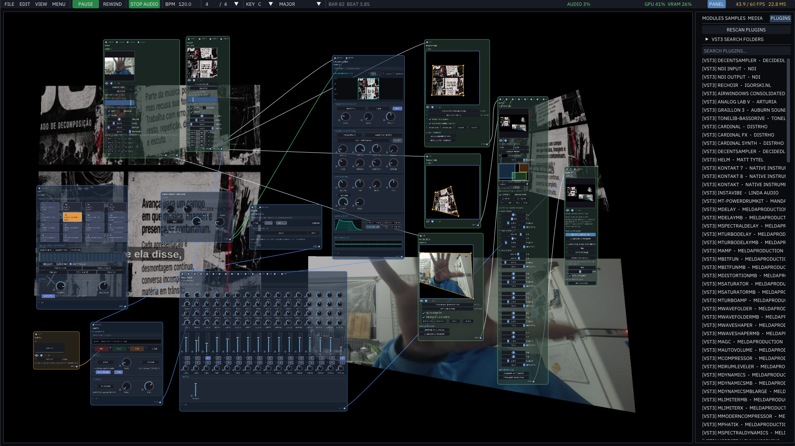

# Infinite-Turbo (for Windows)

[](https://github.com/n1m21n/Infinite)
[](https://discord.gg/wpKdexvhn)

**Version 0.51.0-turbo** · Windows 10/11 x64 · unofficial mod of [Infinite](https://github.com/n1m21n/Infinite)

Infinite-Turbo is a Windows-only mod of **Infinite**, the node-based audiovisual workstation by Naman Soni: realtime image and video processing, procedural 3D, synthesis and DSP, VST3 hosting, MIDI, OSC and CV modulation across all of them, in one patch.

The core is Infinite (same graph, same modules, `.inf` patches). Turbo adds Windows tuning, a performance toolkit (clip launcher, timeline, samplers, looper, mixer, layout, projection) and an MCP server so Claude can build patches with you.



## Contents

- [Quick start](#quick-start)
- [What Turbo adds](#what-turbo-adds)
- [Build patches with Claude (MCP)](#build-patches-with-claude-mcp)
- [Shortcuts](#shortcuts)
- [Build from source](#build-from-source)
- [Files, logs and troubleshooting](#files-logs-and-troubleshooting)
- [Relationship with Infinite](#relationship-with-infinite)
- [Credits and license](#credits-and-license)

## Quick start

| I want to... | Do |
|---|---|
| use a prebuilt ZIP | extract it to a writable folder (not inside the ZIP), run `install-runtime.bat` once, then `run-windows.bat` |
| set up a dev machine | `install-dependencies.bat` (UAC: Build Tools, vcpkg, libraries, Windows ML, models) |
| compile | `build-windows.bat` (exe in `build\windows-vs2022\Release`) |
| compile and package | `build-windows.bat pack` (`dist\` folder and ZIP) |
| debug build / clean reconfigure | `build-windows.bat debug` / `build-windows.bat fresh` |
| run | `run-windows.bat` |
| connect Claude (MCP) | `setup-mcp.bat`, then restart Claude Desktop |
| make a release (ZIP + notes + tag) | `release-windows.bat`, then upload `dist\release\*` on the GitHub page it opens |
| run the self-tests | `test-windows.bat` (`-Quick` for a smoke run) |
| report a startup problem | `diagnose-windows.bat` (writes `Infinite-Turbo-diagnostic.log`) |

It opens on the **superSynthMCP** example, playing; Settings > Startup turns that off.

## What Turbo adds

Version by version detail: [CHANGELOG-TURBO.md](CHANGELOG-TURBO.md).

### Performance and sequencing

| Feature | What it does |
|---|---|
| **Clip Matrix** | session view for audio, video and image clips: tracks x scenes (4 x 8 up to 16 x 16), launches quantized on the audio thread, loop / once / gate, tempo sync and pitch per clip, follow actions, scenes with tempo and meter, MIDI and CV launching, recording into the timeline. **Clip Matrix Out** splits it into one video + audio output per track |
| **Arrangement Timeline** | upstream's timeline: video and audio tracks, track groups, clips from nodes or files, waveforms and thumbnails, 3D clips, tempo-synced samples, loop, markers, render queue to MP4 / MOV / WAV |
| **Performance Mode** | a dockable panel (PERF, Shift+P) of knobs, faders, XY pads, triggers, selectors and step gates on pages, each bound to any parameter by clicking it, with MIDI learn |
| **Transport Control** | play / stop / tap, tempo glide, external MIDI clock, key and scale, time signature, metronome; every control is a CV pin (the metronome icon in the top bar is a metronome without a node) |
| **Looper** | REC / PLAY / DUB that start in time on the bar, one take-length menu (free, 1/16 bar to 32 bars), layer undo / redo, speed / pitch / fine tune (varispeed), fades, volume, export WAV, latency compensation |
| **MPC** / **MPC Out** | 16 sample pads (one shot, gate, loop), trim, pitch, fine tune, speed (negative = reverse), fades, pan, sync to a musical division, a CV pin per pad, one output per pad |
| **VMPC** | the MPC for video clips, with their soundtrack; transitions between clips (the Slideshow set) |
| **Super Mixer** | 16 channels, EQ, pan, mute / solo, CV everywhere; master VU, pan, mute and a mastering chain (EQ, glue comp, width, saturation, true-peak limiter, each with bypass) |
| **Waveforms and trim** | real min / max / RMS waveforms with a play cursor per voice, zoom to the trim range, time readout and Shift-fine trim handles (Sampler, Drum lanes, MPC pads, Slicer, Molder, Granular, Paul Stretch) |
| **Sample / media library** | your own library folders, browse by folder with a breadcrumb, search across all, no duplicates; drag a kit folder onto a Drum Sequencer or MPC |
| **MIDI File** | plays a .mid file (drop it on the canvas) in time with the transport, starting on the quantize grid; track and channel filter, transpose, velocity, loop, piano-roll preview |
| **Drum Sequencer patterns** | 141 grooves in 10 groups (rock, funk and breaks, hip hop, electronic, latin, Brazil, Middle East, India, Africa, jazz), each in three parts (A verse, B bridge, C chorus with a fill), picked by group and groove with A / B / C buttons; two-tone bells; empty lanes get the bundled Turbo kit; edits kept per part, user presets, import .mid (GM drums), your own MIDI groove folder |
| **Chord Progression** | chords held per bar, strum / arp / pulse modes; the builder now has extended, altered and quartal chords (11, 13, maj9#11, 7alt, 7#9, 6/9, so what...); quantized restart; chord names spelled MAJ / MIN; duplicate / drag slots, typed lengths, extension chips, playable 4-octave keyboard |
| **Scenes** | radio-button scene launcher, one button for several changes: up to 8 scenes x 8 outputs cabled to any params (switcher slot, drum part, mutes, restart triggers), quantized, every scene mappable |
| **Note Switcher** | up to 8 note inputs, quantized manual switching, mappable slot buttons |

### Video and output

| Feature | What it does |
|---|---|
| **Layout** | pixel-exact canvas (e.g. 1920 x 1080) with 8 layers, drag on the miniature, fit / fill / 1:1 |
| **Projection** | warp with alpha outside, per-edge blend, antialiased outline |
| **Output windows** | exact pixel size, fit / 1:1 / fill / stretch, F11 fullscreen on any monitor, stays on top |
| **Canvas preview** | any node's image behind the patch (Ctrl+Shift+B), with F11 borderless UI for live coding |
| **Spout In / Out** | Spout2 sender and receiver (old `Syphon` patches still open) |
| **Background removal** | U2Net on Windows ML / DirectML (any DX12 GPU), CPU fallback |

### Control and plugins

| Feature | What it does |
|---|---|
| **MIDI learn** | any parameter with a CV pin (Ctrl+M), per device and channel, soft takeover, ranges, saved with the patch |
| **Range mapper** | right-click a modulated parameter: input range, output range, invert |
| **OSC** | OSC Receive and OSC to CV (8 addresses to 8 CV outputs), on the LAN |
| **VST3** | instruments and effects, plugin state saved with the patch, isolated scanner, GL editors that do not freeze the UI |
| **Gesture recording** | hold Shift while moving a knob, release to loop the movement |

### Patching

| Feature | What it does |
|---|---|
| **Live hints** | an amber border (with a tooltip) on half-wired mixers, empty Outputs and image loops without a Feedback node |
| **Live reload** | the open `.inf` is watched: an outside change reloads it (one undo step), or asks first if you have unsaved edits |
| **Auto layout** | nodes without a position (patches written by hand or by an AI) are laid out by signal flow |
| **Single instance** | double-clicking a `.inf` opens it in the running Infinite-Turbo (asks first if there are unsaved edits) |
| **Interface scale** | follows Windows' display scale per monitor, or a fixed size in Settings |
| **Browser** | favourites, filter and sort for modules, samples, media and plugins |
| **Color markers, comments, groups** | right-click a node; comments are edited by hovering and typing |

### Windows platform

| Original (macOS) | Infinite-Turbo |
|---|---|
| CoreAudio / CoreMIDI | JUCE: WASAPI, ASIO, DirectSound; Windows MIDI and clock |
| Audio Units | VST3 |
| Syphon | Spout2 |
| AVFoundation | OpenCV, DirectShow, FFmpeg |
| Apple Vision | Windows ML, DirectML, OpenCV DNN |
| CoreText | native Windows text rasterizer |
| ModelIO | Assimp (plus glTF / GLB) |

## Build patches with Claude (MCP)

**Inside the app**: CLAUDE in the top bar (Shift+C) opens a chat that runs your own Claude Code (logged in with your Claude account, nothing extra to pay) with Infinite-Turbo's tools. If Claude Code is missing, the window shows the cmd line that installs it: `curl -fsSL https://claude.ai/install.cmd -o install.cmd && install.cmd && del install.cmd`, then run `claude` once to log in.

**From Claude Desktop**:

Infinite-Turbo is also an [MCP](https://modelcontextprotocol.io) server: `Infinite-Turbo.exe --mcp` lets Claude (or any MCP client) read and edit the patch open in the running app.

1. Run `setup-mcp.bat` once. It registers the exe in Claude Desktop's config (other servers are kept, the old file is saved as `.bak`).
2. Quit Claude Desktop completely (tray icon > Quit) and open it again.
3. Ask, for example: *"In Infinite, make a shape go through a blur into an output, and modulate the blur radius with an LFO."*

Claude Code: `claude mcp add infinite-turbo -- "C:\path\to\Infinite-Turbo.exe" --mcp`

The Settings menu has the same setup under "AI assistants", plus **Install AI skill for Claude Code**
and **Save AI skill to a folder** (zip the folder to upload it as a skill in Claude).

If the app is closed, the first request starts it. Every change is one undo step (Ctrl+Z).

| Tool | Purpose |
|---|---|
| `describe` | node types; with a type: inputs, outputs, settings and help |
| `explain` | the live graph: connections, params with ranges, modulation, warnings |
| `create_node`, `connect`, `set_param`, `delete_node`, `disconnect` | edit the graph (slots and outputs by number or label) |
| `modulate`, `set_expression`, `unmodulate` | drive a param by name from a modulator or an expression |
| `batch` | several commands as one undo step, all or nothing (`"$0"` refers to the first result) |
| `patch_format`, `get_patch_text`, `validate_patch_text`, `load_patch_text` | work with the patch as text |
| `screenshot_node`, `render_frame` | look at a node's image or the live Output |
| `authoring_guide` (and the `build_patch` prompt) | the patch-building guide; read once before building |
| `clip_matrix`, `pads`, `looper` | Turbo only: launch clips and scenes, hit MPC/VMPC pads, drive the Looper |
| `drum_pattern` | Turbo only: list the Drum Sequencer's pattern library, load a groove and part (A / B / C), import a .mid, save / load presets |
| `scenes` | Turbo only: set up and fire a Scenes node |
| `perf_list`, `perf_add`, `perf_remove`, `perf_show` | Turbo only: build and open the Performance Mode panel |
| `auto_layout`, `fit_view`, `transport`, `undo`, `redo`, `load_patch`, `save_patch`, `new_patch` | the rest |

The control port listens on `127.0.0.1:7777` only (`INFINITE_CONTROL_PORT` changes it) and needs the token the app writes to `%LOCALAPPDATA%\Infinite\control_token`.

## Shortcuts

| Keys | Action |
|---|---|
| Ctrl+N / O / S / Shift+S | new / open / save / save as |
| Ctrl+Z / Ctrl+Shift+Z | undo / redo |
| Ctrl+G / Ctrl+Shift+G | group / ungroup |
| Ctrl+B | side panel |
| Ctrl+Shift+B | selected node behind the canvas |
| F11 | UI fullscreen (editor) or output fullscreen (output window) |
| Shift+T | Arrangement Timeline |
| Ctrl+M | MIDI learn mode |
| Shift+M | modulation matrix |
| Shift+P | Performance Mode |
| Shift+C | Claude chat |
| Space | play / stop |
| Double-click a knob, slider or field | type a value (`=` starts an expression) |
| Shift + drag a knob | record a gesture |
| 1 / 3 / 7 / 0 over a 3D viewport | front / right / top / three-quarter view |

Timeline: B blade, Ctrl+D duplicate, Ctrl+E split, F2 or double-click a track name to rename it.

## Build from source

Requirements: Windows 10/11 x64, `winget`, about 35 GB free for the first dependency build, internet access.

```bat
git clone https://github.com/ricardopalmieri/Infinite.git Infinite-Turbo
cd Infinite-Turbo
install-dependencies.bat
build-windows.bat
```

`install-dependencies.bat` asks for UAC and installs Git, CMake, Visual Studio 2022 Build Tools, vcpkg, OpenCV, Spout2, Assimp, Windows ML, DirectML, FFmpeg and the segmentation models. The first run compiles large libraries and takes a while.

| Output | Path |
|---|---|
| test build | `build\windows-vs2022\Release\Infinite-Turbo.exe` |
| package | `dist\Infinite-Turbo-Windows-x64\` and `dist\Infinite-Turbo-Windows-x64.zip` |

Run `build-windows.bat fresh` after a version change in `CMakeLists.txt` or a dependency update. Details: [WINDOWS_BUILD.md](WINDOWS_BUILD.md).

## Files, logs and troubleshooting

User data lives in `%LOCALAPPDATA%\Infinite` (settings, logs, autosave recovery, VST3 index and blocklist, models, crash dumps in `crash\`). None of it goes into the repository or into patches.

| Problem | Try |
|---|---|
| the app closes at startup | `diagnose-windows.bat`, then send `Infinite-Turbo-diagnostic.log` |
| it closed during work | send the newest file in `%LOCALAPPDATA%\Infinite\crash` |
| crackles / "buffer underruns" | a larger audio buffer; close other apps using the device; ASIO if the interface has it |
| a plugin is missing | VST3 only (no VST2 `.dll`); `Rescan plugins` after changing folders |
| Spout shows nothing | sender and receiver on the same GPU |
| no sound from videos / recording fails | `ffmpeg.exe` must be next to `Infinite-Turbo.exe` |
| Remove Background is slow | update the GPU driver (DirectML); the CPU fallback is used meanwhile |
| the first build fails | do not build inside OneDrive or a read-only folder |

Bug reports: Windows version, CPU / GPU, audio interface and buffer, steps to reproduce, and the log or crash dump above.

## Relationship with Infinite

- Infinite-Turbo started from the Windows R31a community port (upstream [`788404a`](https://github.com/n1m21n/Infinite/commit/788404af4b378941394e2d5dcc45c5542cc903fd)) and dropped every macOS code path in 0.32.
- Upstream features are ported selectively (the Field language is not); the changelog says what came from where.
- Patches with Turbo-only modules do not open in upstream Infinite, and the two are not guaranteed to open each other's files.
- Report Turbo problems here, not to the upstream project. The R31a snapshot stays on the `windows/r31a-snapshot` branch.

```text
src/core/       graph, patch format, transport, modulation, RPC
src/nodes/      visual, 3D, audio, MIDI, CV and UI nodes
src/arrange/    Arrangement Timeline
src/audio/      audio engine, DSP, plugin scanning, file writing
src/platform/   Windows layer (JUCE, OpenCV, Spout2, Windows ML, Win32, MCP bridge)
scripts/, cmake/, assets/   packaging, resources, fonts and examples
```

## Credits and license

- Infinite: [Naman Soni](https://github.com/n1m21n). Its module architecture descends from [BespokeSynth](https://github.com/BespokeSynth/BespokeSynth).
- Windows port and Infinite-Turbo: [Ricardo Palmieri](https://github.com/ricardopalmieri) / Noisetupi.
- Third-party: Dear ImGui, imgui-node-editor, GLFW, JUCE, OpenCV, FFmpeg, Spout2, Assimp, Windows ML, DirectML, ONNX Runtime, signalsmith-stretch, stb and others listed in the build files.

The original Infinite source is MIT licensed ([LICENSE](LICENSE)). A compiled binary links components with their own terms (JUCE, VST3, FFmpeg, OpenCV, Spout2, Assimp, Windows ML, ONNX Runtime, DirectML): review them before redistributing. JUCE may need a commercial license depending on how the binary is distributed.
