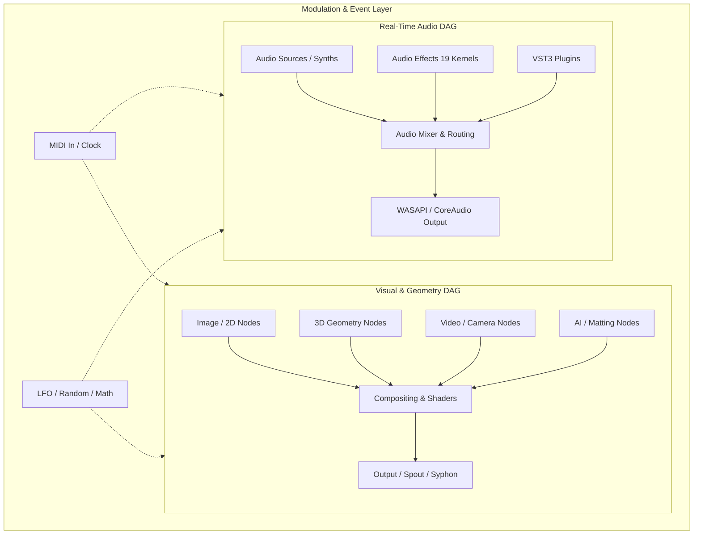

# Windows Compatibility & Engineering Standards Manual

This document is the authoritative engineering reference and design standard for developing, maintaining, and verifying **Infinite** for Windows while working primarily on macOS.

---

## 1. Executive Architecture Summary: macOS vs. Windows

Infinite relies on a dual-DAG architecture (Visual/GL DAG and Real-Time Audio DAG). The abstraction is maintained strictly behind `src/platform/Platform.h` and the C++ engine core.

| Subsystem | macOS Implementation | Windows Implementation | Architectural Invariant / Gotcha |
| :--- | :--- | :--- | :--- |
| **Windowing & GL** | GLFW + Apple NSOpenGL / CGL | GLFW + WGL + Glad loader (`gl.c`) | Always call `gladLoadGL((GLADloadfunc)glfwGetProcAddress)` immediately after context creation. |
| **Audio Driver** | CoreAudio HAL / `AVAudioEngine` | WASAPI Shared Mode + MMCSS | Thread must register with `AvSetMmThreadCharacteristicsW(L"Pro Audio")`. Handle ~10ms (480-frame) non-power-of-two buffer sizes. |
| **Audio File Decode** | `AVAudioFile` / `ExtAudioFile` | `dr_libs` (wav, mp3, flac) + libFLAC + custom AIFF | Must use wide-path APIs (`_w` variants) to avoid UTF-8 file path mangling on Windows. |
| **Audio Effects** | Single `AudioEffectNode` + 19 kernels | Single `AudioEffectNode` + 19 kernels | Identical C++ DSP core. Avoid denormals (`_MM_SET_FLUSH_ZERO_MODE`). |
| **FFT Math** | Apple `Accelerate.framework` (vDSP) | `PortableFft` (Radix-2 FFT/IFFT) | Twiddle tables and scaling must match forward/inverse DFT round-trip exactly. |
| **Plugin Hosting** | Audio Units (AUv2/AUv3) + VST3 | VST3 SDK 3.7+ (IComponent / HWND) | Separate console scanner (`infinite-vst3-scanner.exe`) isolates crashes via stdout IPC. |
| **Video Playback** | AVFoundation (`AVAssetReader`) | Media Foundation (`IMFSourceReader`) | Always query `MF_MT_DEFAULT_STRIDE` or `IMF2DBuffer2` to prevent row-skew on unaligned video widths. |
| **Camera Capture** | AVFoundation (`AVCaptureSession`) | Media Foundation (`MFEnumDeviceSources`) | Worker thread continuous pull into latest-frame slot; avoid blocking the UI frame loop. |
| **Video Recording** | AVFoundation (`AVAssetWriter`) | Media Foundation (`IMFSinkWriter`) | Swizzle bottom-up GL RGBA to top-down BGRA for hardware H.264 encoder. |
| **AI Matting** | Apple Vision Framework | ONNX Runtime + DirectML (`u2netp.onnx`) | Requires `onnxruntime.dll`, `DirectML.dll`, and model weights staged adjacent to `Infinite.exe`. |
| **Inter-App Sharing**| Syphon (IOSurface / CGL) | Spout2 (DirectX11 / DXGI Shared Textures) | Zero-copy GPU texture bridge via `SpoutGLBridge` converting `GL_TEXTURE_2D` to `GL_TEXTURE_RECTANGLE`. |
| **Typography / Text**| CoreText / CoreGraphics | GDI (`GetGlyphOutlineW` TTF/CFF) | Measure cap height from char `'H'`, NOT with `GGO_GLYPH_INDEX`. Step spline at `t = s / steps`. |
| **Settings & Paths** | `~/Library/Application Support/Infinite` | `%APPDATA%\Infinite` | Never hardcode `$HOME` or `\`. Query `SHGetKnownFolderPath` for Desktop/Documents. |
| **Patch Extension**  | `.inf` | `.infinite` | Default to `.infinite` on Windows to avoid clashing with Windows Setup Information files. |

---

## 2. Comprehensive Node-by-Node Audit & Compatibility Matrix

Every node in Infinite falls into one of eight functional domains. The table below details the platform-specific dependencies, memory models, and Windows invariants for each.



### 2.1 2D Visuals, Generators, Shaders & Compositing

| Node Name | Backing Implementation & Windows Bridge | Windows Traps & Invariants | Performance / Design Standard |
| :--- | :--- | :--- | :--- |
| **ImageSourceNode** | `stb_image` / `Platform::LoadImageRGBA` | Non-ASCII path handling. Use `_wfopen` or `std::wstring`. | Bottom-up row flip for GL. Pre-multiply alpha where necessary. |
| **ShapeNode** | GLSL 330 Core procedural SDFs | Intel iGPU / AMD drivers enforce strict GLSL type matching (e.g. `1.0` vs `1`). | Zero host-memory allocation in cook loop. Shader compiled once at init. |
| **FormulaNode** | User GLSL expression compiler | Driver error log parsing must handle varying vendor formatting (NVIDIA vs AMD). | Strict syntax sandboxing and graceful fallback shader on syntax error. |
| **FilterNode** | 30+ GLSL Shader passes in `FilterDefs.cpp` | Ensure uniform precision compatibility across mobile Intel/AMD GPUs. | Framebuffer Object (FBO) pooling; avoid recreating FBOs on resize. |
| **BlendNode** | GLSL two-input compositing | Math clamping (`clamp(val, 0.0, 1.0)`) prevents NaN propagation. | Shared fullscreen quad VAO. |
| **LayerStackNode** | 4-input layered compositing | Unconnected input pins must bind fallback 1x1 black/transparent texture. | Single-pass shader multi-sampling. |
| **FitNode** | Resolution & aspect ratio adaptor | Viewport scissor test state must be restored after rendering. | Texture filtering (linear vs nearest) configured per user toggle. |
| **RampNode** | Multi-stop procedural gradient | Uniform array size limits on older Intel drivers (keep <= 16 stops). | 1D / 2D procedural generation on GPU. |
| **ColorRampNode** | Texture-based transfer color map | Texture wrap mode must be `GL_CLAMP_TO_EDGE` to avoid edge bleed. | Cached 256x1 1D LUT texture. |
| **PaletteNode** | Oklab k-means clustering on CPU | Memory buffer alignment on x86_64 vs ARM64. | Runs on worker thread; updates main thread via atomic dirty flag. |
| **DrawNode** | Persistent paint canvas FBO | FBO attachments must survive window resize and device reset. | Dual-buffered ping-pong FBO for undo/stroke accumulation. |
| **CurvesNode** | Photoshop-style RGB/Luma curves | Cubic Hermite spline evaluation must avoid division by zero. | 256-entry 1D LUT texture uploaded only when curve control points move. |
| **ResynthNode** | Iterative image feedback mutator | Ping-pong FBO texture feedback. Ensure no write-while-read hazard. | Frame-rate decoupled decay rate. |
| **NoiseNode** | Simplex / Perlin / Voronoi / Ridged | Truncation in GPU floating point noise hashing across vendors. | Pure GLSL implementation; no CPU noise table uploads. |
| **TextureNode** | Procedural patterns (Checker, Stripes, Dots)| Strict float literals in GLSL (`float(x)` conversions). | Procedural fragment shader. |
| **FeedbackNodes** | Reaction-Diffusion / Trail buffers | Texture format must be `GL_RGBA16F` or `GL_RGBA32F` for numerical stability. | Double-buffered FBOs with persistent historical states. |
| **SwitcherNode** | Clocked input multiplexer | Time-delta calculation must use monotonic clock (`std::chrono::steady_clock`). | Zero-copy texture pointer routing. |

### 2.2 3D Geometry & Rendering Pipeline

| Node Name | Backing Implementation & Windows Bridge | Windows Traps & Invariants | Performance / Design Standard |
| :--- | :--- | :--- | :--- |
| **Geometry3DNodes** | 24 procedural primitives (`Mesh.cpp`) | Clockwise vs Counter-Clockwise vertex winding and index buffer limits. | Standard vertex struct layout: 32 bytes (Pos3f, Norm3f, UV2f). |
| **ModelSourceNode** | Hand-rolled OBJ/PLY/STL parser (`MediaDecodeWin.cpp`) | Large 3D files (>50MB) must not freeze UI. ModelIO unavailable on Windows. | Background parsing thread; interleaved vertex upload to VBO. |
| **Text3DNode** | GDI `GetGlyphOutlineW` -> Poly tessellation | **Blocker 1.4**: Must query char `'H'` without `GGO_GLYPH_INDEX`. Step `t=s/steps`. | Polygon hole nesting detection via winding rules; extruded 3D bevel. |
| **EnvironmentNode** | `tinyexr` + `miniz` (.exr) / `stb_image` (.hdr) | Line endings in EXR header parser. Floating-point exposure mapping. | 32-bit float RGB texture, equirectangular to cubemap conversion. |
| **OceanNode** | Gerstner wave simulation grid | Large vertex grid VBO updates. | CPU wave math or GPU vertex displacement with normal recalculation. |
| **SimulationNodes** | Cloth / Particle physics engine | Euler / Verlet integration step must be clamped to avoid delta spikes. | Sub-stepped physics clock (e.g. 120Hz fixed step). |
| **GenerativeNodes** | 3D L-System / Recursive fractals | Memory limits on recursion depth; guard against stack overflow. | Dynamic vertex buffer reallocation with high-water mark caching. |
| **GeometryOpNodes** | Subdivide, Boolean, Twist, Bend, Extrude | Mesh revision stamp (`MeshRevision()`) must ONLY increment on true mutation. | In-place vertex manipulation where possible. |
| **PointDistributionNodes** | Surface Poisson / Random point scatter | Seed reproducibility between Windows x64 and ARM64. | Deterministic Mersenne Twister / PCG hash generator. |
| **SceneNodes** | Cameras & Lights | Uniform buffer alignment (16-byte std140 rule). | View/Projection matrix calculation matching GL NDC [-1, 1]. |
| **CurveNode** | 3D Bezier curve generator | Curve parameter subdivision threshold. | Adaptive subdivision based on screen-space curvature. |

### 2.3 Video, Camera & Machine Learning

| Node Name | Backing Implementation & Windows Bridge | Windows Traps & Invariants | Performance / Design Standard |
| :--- | :--- | :--- | :--- |
| **VideoSourceNode** | Media Foundation `IMFSourceReader` | **Blocker 1.7**: Compute stride via `MF_MT_DEFAULT_STRIDE` or `IMF2DBuffer2`. | Synchronous reader on worker thread; GL upload on main thread. |
| **VideoInNode** | Media Foundation Camera Enumeration | DirectShow cameras vs Media Foundation capture devices. | Async capture thread continuously buffering the latest frame. |
| **RemoveBgNode** | DirectML + ONNX Runtime (`u2netp.onnx`) | `onnxruntime.dll` & `DirectML.dll` must sit next to `.exe`. | DirectML GPU execution provider with fallback to CPU EP if missing DML. |

### 2.4 Inter-App Video Sharing & Projector Output

| Node Name | Backing Implementation & Windows Bridge | Windows Traps & Invariants | Performance / Design Standard |
| :--- | :--- | :--- | :--- |
| **SyphonInNode** | Spout2 `SpoutReceiver` on Windows | Syphon expects `GL_TEXTURE_RECTANGLE`. Bridge blits `GL_TEXTURE_2D`. | Zero-copy DirectX 11 / WGL interop texture handle sharing. |
| **SyphonOutNode** | Spout2 `SpoutSender` on Windows | Spout sender registration name collisions. | Share GL texture directly through DXGI shared handle. |
| **ProjectionNode** | Homography corner-pin warp | 4-corner perspective transform matrix math. | GL mesh grid warp (e.g. 32x32 grid) or fragment shader homography. |
| **OutputNode** | Media Foundation `IMFSinkWriter` (MP4/H.264)| glReadPixels bottom-up RGBA must be flipped & swizzled to BGRA. | Asynchronous frame queue with dropped-frame tracking. |

### 2.5 Real-Time Audio Synthesizers & Sources

| Node Name | Backing Implementation & Windows Bridge | Windows Traps & Invariants | Performance / Design Standard |
| :--- | :--- | :--- | :--- |
| **AudioNodes** | Gain, Pan, Mixer, Splitter, Merger | SIMD float array multiplication. Real-time safety (no malloc/free). | Planar 32-bit float buffers (`float**`). Zero lock contention. |
| **OscillatorNode** | PolyBLEP antialiased analog oscillator | Phase accumulator wrap-around precision. | Anti-aliased waveforms (Saw, Square, Triangle, Sine) with unison. |
| **WavetableNode** | 10-level Fourier mip wavetable synth | 12 tables x 8 frames x 10 mip levels. Mip selection based on note pitch. | Zero-allocation audio thread playback; linear interpolation across frames. |
| **WaveTerrainNode** | 2D surface scanning oscillator | Surface equation bounds clamping. | Real-time 2D bilinear surface interpolation. |
| **EquationNode** | Real-time mathematical expression synth | Anti-aliased wavetable generated via Radix-2 FFT (`PortableFft`). | Background worker evaluates expression -> Fourier mip pyramid. |
| **ImageSpectralSynthNode**| Additive spectral resynthesis | Resynthesis voice limit (<= 64 sine oscillators). | Fast table-lookup oscillator bank. |
| **MetallicNode** | Modal / Karplus-Strong physical modeling | Delay line buffer wraparound indexing. | Ring-buffer delay lines sized once at initialization. |
| **SamplerNode** | Multi-sample player via `SampleSlot` | Lock-free buffer replacement via generation-retired slot pattern. | Sinc / Cubic spline pitch interpolation. |
| **PaulStretchNode** | Extreme time-stretch phase vocoder | **Blocker 1.1**: `PortableFft::Inverse` must negate twiddle sine term. | FFT window sizes (2048 to 16384) preallocated in `Prepare()`. |
| **MolderNode** | STFT additive resynthesis synth | 3-thread architecture: Main, Worker (STFT analysis), Audio (playback). | Lock-free atomic ready flag handoff to `SampleSlot`. |
| **GranularNode** | Real-time granular cloud synth | Grain envelope interpolation and random jitter bounds. | Preallocated grain pool (e.g. 64 active grains maximum). |
| **DrumSequencerNode** | 8-lane sample sequencer | Clock sync with transport and swing timing. | Sample-accurate trigger scheduling within block buffer. |

### 2.6 Audio Effects Processing (19 DSP Kernels)

All audio effects instantiate through `AudioEffectNode` wrapping an `IEffectKernel`:

```
Effect Def Table (src/audio/EffectDefs.cpp)
├── Audio Filter     ──> AudioFilterKernel (Zavalishin TPT 12/24dB State Variable Filter)
├── EQ               ──> EqKernel (4-band parametric biquad equalizer)
├── Dynamics         ──> DynamicsKernel (Peak/RMS compressor/expander with lookahead)
├── Delay            ──> DelayKernel (Stereo ping-pong / tape delay with feedback saturation)
├── Reverb           ──> ReverbKernel (Feedback Delay Network / Freeverb FDN)
├── Drive            ──> DriveKernel (Wave-shaper, soft-clipping, tube / asymmetric saturation)
├── Stereo           ──> StereoKernel (Haas effect, stereo width, mid/side matrix)
├── Pitch Shifter    ──> PitchShiftKernel (Dual-delay grain crossfader)
├── Chorus           ──> ChorusKernel (Multi-tap modulated delay line)
├── Flanger          ──> FlangerKernel (Short delay with high feedback & through-zero)
├── Phaser           ──> PhaserKernel (Cascaded allpass filters with LFO modulation)
├── Bitcrush         ──> BitcrushKernel (Sample rate decimation & bit depth reduction)
├── Transient Shaper ──> TransientShaperKernel (Fast/Slow envelope follower differential)
├── Stutter          ──> StutterKernel (Buffer loop capture & re-trigger)
├── Ring Mod         ──> RingModKernel (Sine/Square carrier multiplication)
├── Frequency Shifter──> FrequencyShifterKernel (Hilbert transform analytic pair multiplier)
├── Tremolo          ──> TremoloKernel (LFO amplitude modulator with wave shapes)
├── Formant Filter   ──> FormantFilterKernel (Vowel formant vocal resonators)
├── Wavetable Shaper ──> WavetableShaperKernel (Transfer curve from wavetable frame)
└── Limiter          ──> LimiterKernel (Transparent brickwall lookahead peak limiter)
```

**DSP Compatibility Rule**: All kernels must execute with denormals flushed to zero (`_MM_SET_FLUSH_ZERO_MODE(_MM_FLUSH_ZERO_ON)` and `_MM_SET_DENORMALS_ZERO_MODE(_MM_DENORMALS_ZERO_ON)`). Parameter modulation from `ParamMailbox` must use linear/exponential smoothing per sample block.

### 2.7 Third-Party Plugin Hosting (VST3)

| Component | macOS Implementation | Windows Implementation | Standard / Architectural Rule |
| :--- | :--- | :--- | :--- |
| **Plugin Backend** | Audio Units + VST3 | VST3 SDK 3.7+ only | `INFINITE_ENABLE_VST3=1` default. Strict GPLv3 compliance notice. |
| **Plugin GUI** | Cocoa `NSView` inside `NSWindow` | Win32 `HWND` embedded in top-level window | Window messages dispatched via standard Win32 message pump. |
| **Crash Protection** | Separate process scanner | `infinite-vst3-scanner.exe` + stdout IPC | 10-second child process watchdog timer + persistent blocklist. |
| **Audio Processing** | `IAudioProcessor::process` | `IAudioProcessor::process` | 64-bit float fallback to 32-bit float; silence empty input buffers. |

### 2.8 MIDI & Control Hardware

| Component | macOS Implementation | Windows Implementation | Standard / Architectural Rule |
| :--- | :--- | :--- | :--- |
| **MIDI In** | CoreMIDI Client | WinMM (`midiInOpen`) | **Blocker 1.8**: MPMC lock-free note ring buffer with `seq` sequencing. |
| **MIDI Clock** | CoreMIDI Realtime Events | WinMM `0xF8` Clock Status | **Blocker 1.3**: Decode `status >= 0xF0` before masking channels. |
| **OSC Network** | BSD Sockets | Winsock2 (`ws2_32.lib`) via `NetCompat.h` | Use `SOCKET` type (not truncated `int`), call `WSAStartup`/`WSACleanup`. |

---

## 3. Core Architectural Choices & Windows OS Invariants

### 3.1 WASAPI Real-Time Audio Subsystem

1. **MMCSS Thread Scheduling**:
   ```cpp
   DWORD taskIndex = 0;
   HANDLE hMmcss = AvSetMmThreadCharacteristicsW(L"Pro Audio", &taskIndex);
   // ... run audio render loop ...
   if (hMmcss) AvRevertMmThreadCharacteristics(hMmcss);
   ```
2. **Buffer Quantum Adaptor**:
   - WASAPI Shared mode defaults to device-preferred packets (typically 10ms = 480 frames at 48kHz).
   - Audio graph internals assume blocks up to `kPlanarCapacity` (4096 frames).
   - Request `min(framesAvailable, kPlanarCapacity)` from `GetBuffer` to prevent buffer mismatch errors.
3. **Safe Teardown & Device Recovery**:
   - Never rely on `running.load()` to decide whether to join `renderThread`. Always call:
   ```cpp
   if (mThread.joinable()) {
       mRunning.store(false, std::memory_order_release);
       SetEvent(mWakeEvent);
       mThread.join();
   }
   ```

### 3.2 File System, Paths & Encodings

1. **UTF-8 to UTF-16 Everywhere**:
   - Internal engine strings are strictly UTF-8 (`std::string`).
   - Every Win32 file call must convert using `WinCommon::Utf8ToWide(path)`.
   - Never use standard ANSI `fopen()` or `std::ifstream(path)` with multibyte strings on Windows. Use `_wfopen()` or `std::filesystem::u8path()`.
2. **Settings Directories**:
   - macOS: `~/Library/Application Support/Infinite`
   - Windows: `%APPDATA%\Infinite` (retrieved via `SHGetKnownFolderPath(FOLDERID_RoamingAppData)` or `getenv("APPDATA")`).
3. **User Desktop & Media Paths**:
   - Do NOT construct paths via `$HOME/Desktop` or `%USERPROFILE%\Desktop`.
   - Use `SHGetKnownFolderPath(FOLDERID_Desktop, 0, nullptr, &wpath)` to support OneDrive redirection and non-English Windows profile paths.

### 3.3 Shaders, OpenGL & GPU Portability

1. **Shader Language Standard**:
   - Target `#version 330 core` strictly.
   - Forbid implicit type conversions in GLSL (e.g. `vec2(1, 0)` is illegal in GLSL 330 core; must be `vec2(1.0, 0.0)`).
   - Ensure all uniform floats and integers match host types.
2. **Driver Quirks (NVIDIA vs AMD vs Intel)**:
   - Intel iGPU drivers enforce strict sampler binding rules. Ensure texture units are bound sequentially (`GL_TEXTURE0`, `GL_TEXTURE1`).
   - Framebuffers with mixed attachment dimensions are undefined on older AMD drivers. Always resize color and depth attachments symmetrically.

---

## 4. Performance Standards & Benchmarks

To ensure consistent 60+ FPS rendering and sub-15ms audio latency on Windows machines:

```
Performance Budget (per 16.6ms frame at 60 FPS)
├── CookIfNeeded & DAG Evaluation: < 2.0 ms
├── GL Geometry & Shader Passes:   < 8.0 ms
├── ImGui Canvas & Node UI Render: < 3.0 ms
└── Buffer Swapping & Event Poll:  < 3.6 ms
```

1. **Audio Real-Time Budget**:
   - Audio buffer block (typically 128-512 samples) has a hard budget of `< 1.5 ms`.
   - **Zero heap allocations** (`malloc`, `new`, `std::vector::resize`, `std::string`) on the audio render thread.
   - **Zero system calls or locks** (`std::mutex`, file I/O, COM calls).
2. **SIMD & Floating-Point Optimizations**:
   - MSVC compiles with `/fp:fast` or standard `/fp:precise` with explicit AVX2 vectorization.
   - Arm64 Windows targets use `sse2neon.h` for Spout/DSP acceleration.
3. **Static CRT & Distribution Efficiency**:
   - CMake must enforce `CMAKE_MSVC_RUNTIME_LIBRARY "MultiThreaded$<$<CONFIG:Debug>:Debug>"`.
   - Shipped binaries must have zero external VC++ Redistributable dependencies (`MSVCP140.dll` / `VCRUNTIME140.dll`).

---

## 5. The Mac Developer's Windows Verification Protocol

Since development occurs primarily on macOS, follow this verification matrix before pushing code:

### 5.1 Local Pre-Commit Verification (macOS)

```bash
# 1. Run full code hygiene & test sweep
./.github/scripts/headless-tests.sh build/Infinite.app/Contents/MacOS/Infinite

# 2. Verify DSP Math invariants
export INFINITE_DSPTEST=1
./build/Infinite.app/Contents/MacOS/Infinite

# 3. Verify audio parameter sweeps & revision stamps
export INFINITE_AUDIOPARAMTEST=1
export INFINITE_REVISIONTEST=1
./build/Infinite.app/Contents/MacOS/Infinite
```

### 5.2 Automated CI Gate (.github/workflows/build.yml)

Every push triggers the Windows x64 and ARM64 CI matrix:
1. **MSVC Compilation**: Verifies compile cleanliness under MSVC 2022 `/O2` and `/Od`.
2. **Headless Self-Tests**: Runs `INFINITE_DSPTEST`, `INFINITE_TEXTOUTLINETEST`, `INFINITE_SPOUTTEST` on the Windows runner.
3. **Static CRT Assertion**: Scans PE import tables of `Infinite.exe` and `infinite-vst3-scanner.exe` to guarantee zero `MSVCP140.dll` dynamic imports.

### 5.3 Parallels Desktop Testing (Apple Silicon Mac)

1. Download the `Infinite-windows-ARM64` (or `x64`) artifact from GitHub Actions.
2. Launch in Windows 11 under Parallels.
3. Verify:
   - Native font rendering and text scale.
   - VST3 scanning and UI window embedding.
   - Audio device selection under WASAPI.
   - File drag-and-drop (.infinite patches, .wav, .png, .obj).
   - Projector multi-window topmost behavior.
